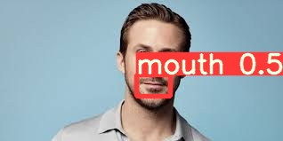

This is a pre-trained Yolo v5 for lips detection task. Just in case if someone will need it. I also provide labeled (by myself) data on which it has been trained (<b>data_for_yolo</b> folder). The original dataset is called AVLetters2.

Usage:

```
    python detect.py --source gosling.jpg --weights lips.pt
```

Where <b>gosling.jpg</b> - input image (could be also a video, folder with images, your webcam and a lot of other inputs, check official YoloV5 repo for more information).<br>
<b>lips.pt</b> - pretrained weights<br>
The output will be in <b>run/detect/expX</b> folder.<br>

Input:<br>

<br><br>
Output:<br>


You can use the weights for any purposes.